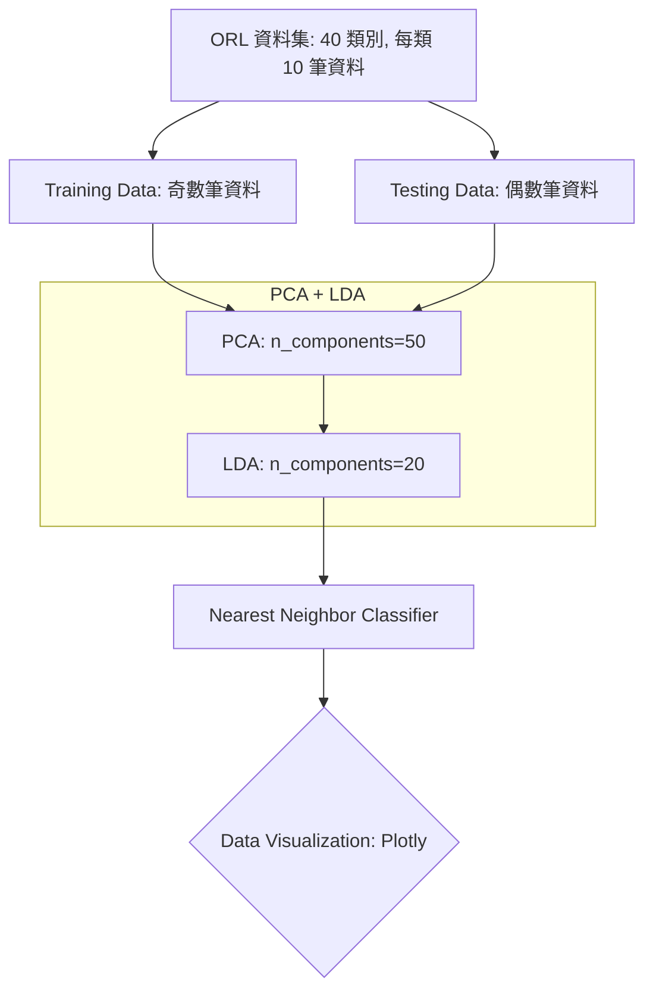

## facial-recognition_NNclassifier

### 流程

```mermaid
graph TD
    A[ORL 資料集: 40 類別, 每類 10 筆資料] 
    A --> B[Training Data: 奇數筆資料] 
    A --> C[Testing Data: 偶數筆資料] 

    subgraph PCA + LDA
        D[PCA: n_components=50] --> E[LDA: n_components=20]
    end

    B --> D
    C --> D

    E --> F[Nearest Neighbor Classifier]
    F --> G{Data Visualization: Plotly}

```
### 實作結果

